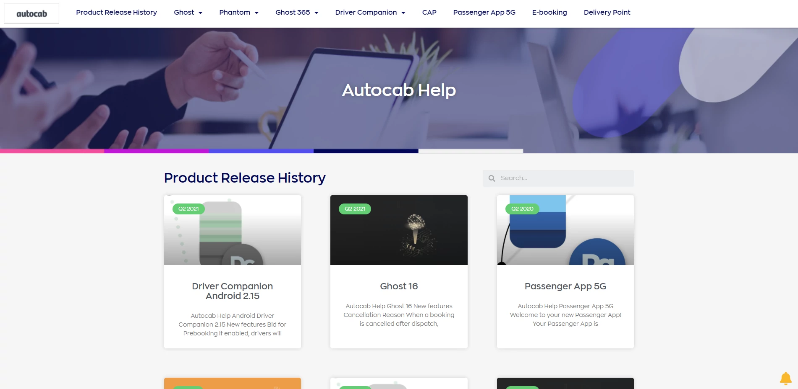

# Connor Partington

Hi, I'm Connor Partington, a UK based Technical Writer with several years of technical and UX writing experience. If you need help with technical or user experience writing, let me help you by:

* building you a knowledge base to help your customers self-serve.
* authoring internal and external content for your products and processes.
* collaborating with your teams to design features that are easy to use and understand.
* implementing standard operating procedures to guide your staff and capture knowledge. 

This is my website for showcasing my technical writing experience and helping you get to know me. 

## Why use a Technical Writer?

I'm one of the very first users of your product, and the difficulties I find when using your product are the difficulties your customers might eventually face.

As a Technical Writer, I can take these difficulties and create comprehensive documentation that covers every question an end-user may ask and solutions to each problem they may face. 

## Why me?

I have a unique blend of technical expertise and writing skills that allows me to communicate complex information in a clear and concise manner. 

I've experienced working on various projects, from software documentation to user guides to marketing materials, and have a strong track record of delivering high-quality work on time every time. 

I'm also a strong collaborator who thrives in a team environment, and enjoy helping to create a user-friendly content that has a positive impact on users.

**[LinkedIn](https://www.linkedin.com/in/connor-partington/) | [GitHub](https://github.com/Connor-Partington)**

## Skills

* Writing, editing, proofreading 
* Copywriting, microcopy  
* Markdown, HTML, CSS 
* User-centred documentation 
* User-centred design 
* Project management  
* Translation management 

## Tools

* Zendesk, WordPress, HubSpot
* Miro, Moqups, GIMP
* Git, GitHub
* JIRA, Monday.com
* VS Code

## Past Projects

### [Autocab Ltd](docs/autocabsaas.md)

Write and edit release notes, online help, user guides, manuals, FAQs, and internal documentation for 12 SaaS products. 

[Learn more](docs/autocabsaas.md)

## Technical samples

These samples are a work-in-progress as I develop my portfolio website. 

[**How I built my site**](docs/how-I-built-my-site.md)

[**Release notes**](docs/release-notes.md)

[**Online help**](docs/online-help.md)

[**Standard Operating Procedure**](docs/sop.md)

[**API Endpoint**](docs/weatherapi.md)

[**Game Unit Description**](docs/game-unit-description.md)

## Open-source contribution

### [Beyond All Reason](https://www.beyondallreason.info/)

Technical Writer for web and in-game content.

## Professional development

Since 2022, I have added UX Writing to my professional development through courses and writing UX copy for software products.