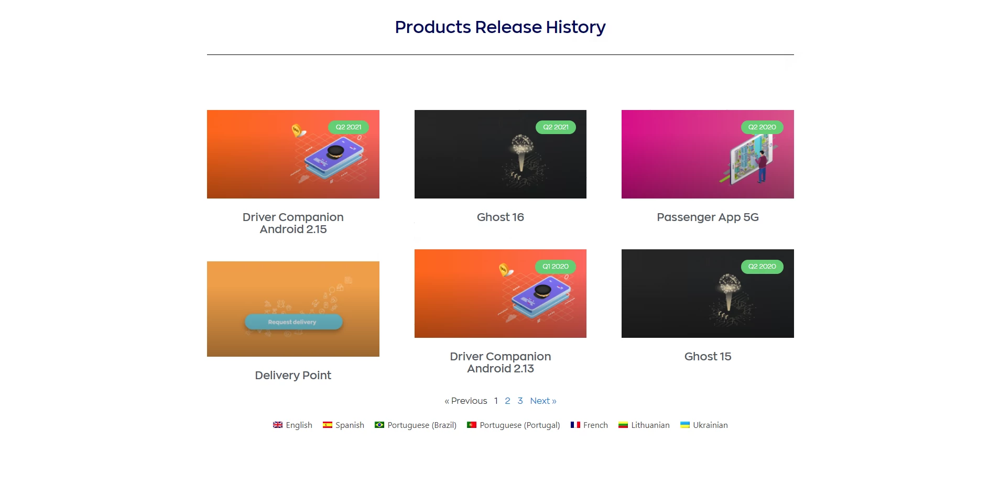

# Autocab SaaS

**Tools used**: WordPress, Zendesk

**Skills**: Writing, Editing, Organisation, Communication, Information Architecture, HTML, CSS, Theme and plugin installation, Web development, UX/UI, and site architecture

This project involved writing end-user documentation for all of Autocab's products, including taxi booking & dispatch software, accounting systems, an Android/iOS passenger and driver app, and a virtual phone system. 

As the sole technical writer, I worked with various SMEs to create topic-based online help. The documentation was hosted on WordPress and delivered through contextual help pages in each product. 

## Audiences

Overall the audience for this documentation was well-educated, but not necessarily technical. So the aim was to create easy-to-understand online help, without too much technical jargon, but at the same time, ensuring everything a user may need was covered. 

## Challenges

Autocab's existing documentation offered several challenges and opportunities:

* Documentation was hosted on WordPress with a single static page for release notes
* The WordPress configuration was disorganised
* Overused plugins were conflicting and causing issues
* Documentation didn't adhere to a style guide
* The documentation contained more marketing copy instead of helpful content 

Before starting any writing:

* Time was spent working with Autocab's WordPress site and products to understand how they work.
* The product categories were organised and the web of conflicting plugins was untangled.
* A style guide was put in place to maintain a consistent style, voice, and tone across the documentation.
* User personas were defined and used to set the audience for each product's documentation.

The existing documentation was then rewritten to match the style guide and audiences, and new documentation was created to fill in any knowledge gaps for each product.

## Outcome 

Instead of a static release notes page, users now had an online knowledge base with categories for each product's documentation, and a search feature to find exactly what they're looking for. 

The project evolved into creating an online help centre based on Zendesk to centralise Autocab's support. This included:

* Creating an external and internal knowledge base.
* Rewriting all existing documentation.
* Configuring a live chat service to aid the support team. 
* Configuring chatbot for automated responses. 
* Working with developers to update contextual help links throughout each product. 

Feel free to can check out [Autocab Help](https://support.autocab.com/hc/en-gb). 