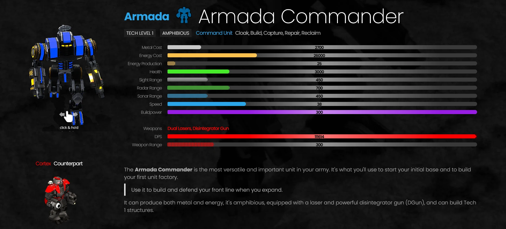

# Game Unit Description

This is a sample of an RTS game unit description I created while contributing to [Beyond All Reason](https://www.beyondallreason.info/). 

## Armada Commander

The **Armada Commander** is the most versatile and important unit in your army. It's what you'll use to start your initial base and to build your first unit factory.

> Use it to build and defend your front line when you expand. 

It can produce both metal and energy, it's amphibious, equipped with a laser and powerful disintegrator gun (DGun), and can build Tech 1 structures. 

