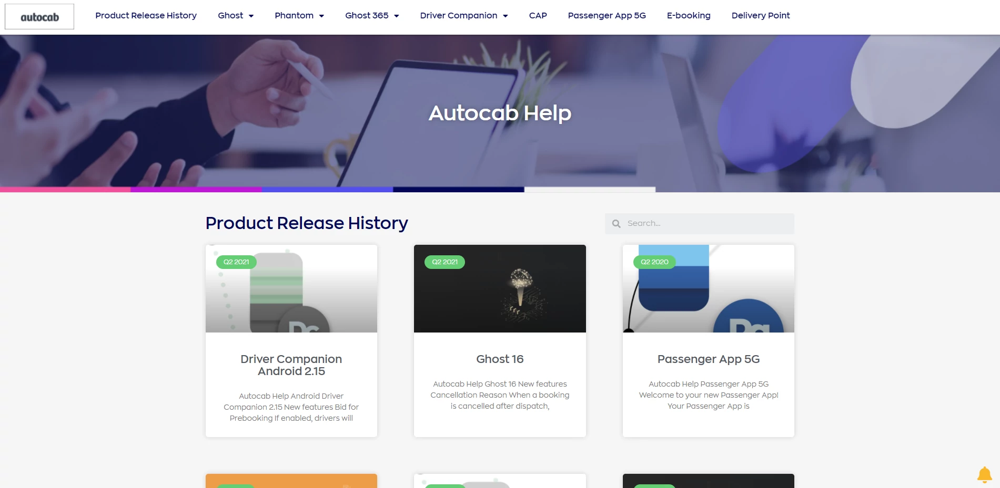
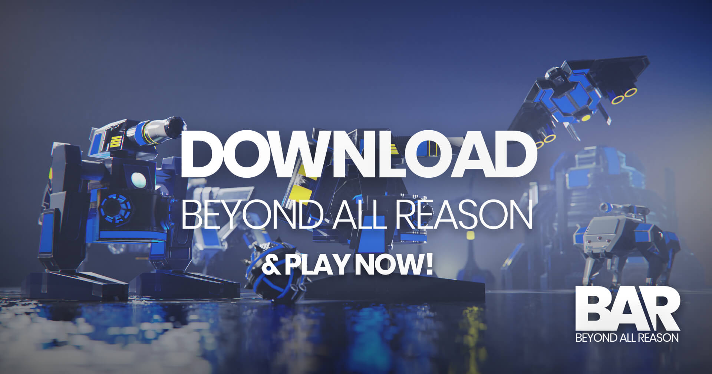

# Connor Partington

I have several years of technical writing experience, including remote and hybrid working, in:

* Writing and publishing technical content,
* Managing information architecture,
* Leading documentation projects, and
* Collaborating with subject matter experts. 

I am currently the first Technical Writer in the Product team at Autocab Ltd and take the unbelievably complicated things our developers create and make them understandable for multiple audiences.

I have worked with mobile and web software development teams to create easy-to-understand documentation for multiple audiences.

Since 2022, I have added UX Writing to my professional development through courses and writing UX copy for software products. I am also contributing to an open-source project to learn how to write for games, and will soon start learning how to document APIs. 

**[LinkedIn](https://www.linkedin.com/in/connor-partington/) | [GitHub](https://github.com/Connor-Partington)**

## Skills

* Writing, editing, proofreading 
* Copywriting, microcopy  
* Markdown, HTML, CSS 
* User-centred documentation 
* User-centred design 
* Project management  
* Translation management 

## Tools

* Zendesk, WordPress
* Miro, Moqups, GIMP
* Git, GitHub
* JIRA, Monday.com
* Text Editors

## Projects

### [Autocab Ltd](autocabsaas.md)

Write and edit release notes, online help, user guides, manuals, FAQs, and internal documentation for 12 SaaS products. 

[Learn more](autocabsaas.md)

## Technical samples

These samples are a work-in-progress as I develop my portfolio website. 

[**How I built my site**](how-I-built-my-site.md)

[**Release notes**](release-notes.md)

[**Online help**](online-help.md)

[**Standard Operating Procedure**](sop.md)

[**API Endpoint**](weatherapi.md)

## Open-source contribution

### [Beyond All Reason](https://www.beyondallreason.info/)

Technical Writer for web and in-game content.

