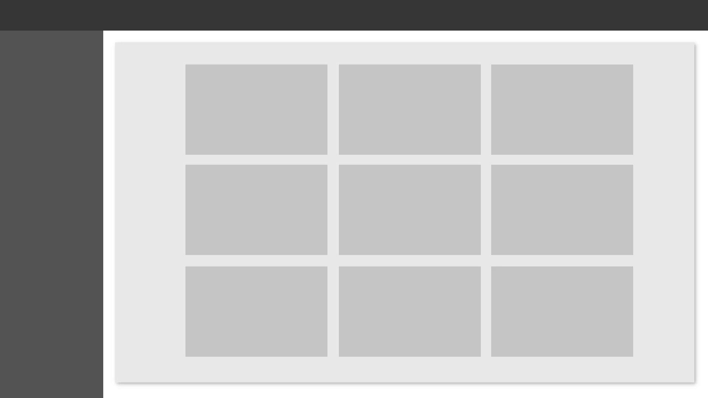

# ManageIt 19.2

Here you will find the latest features, improvements, and bug fixes for ManageIt.

To ensure you have the best experience using our product, we recommend updating to the latest version available.

## What's New

#### Email templates

Send the perfect email every time by using one of our new email templates. Accessed by selecting **Communication > Email Templates** from the main menu. On the Email Templates page, you can preview and use a wide range of email templates to suit your needs. 

## Improvements

#### The faster the better 

We've made some changes and optimised some code, so you should now notice improved loading times through the app. 

#### Sidebar redesign

The sidebar has been completely redesigned to improve usability and to get back the needed space on the main panel.

#### Resize and position

You can now edit the size and position of images you've attached to an email. 

## Bug Fixes

* Setting the date range on a report to a period over 30 days would cause the report to load endlessly. 
* Trying to drag a ManageIt window between multiple screens was resulting in the window becoming transparent. 
* When selecting multiple rows in a table, the "Copy selected" button did nothing at all. 
* Some in-app help pages failed to load after the last update, 